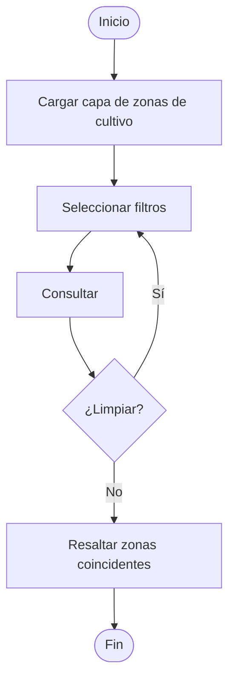
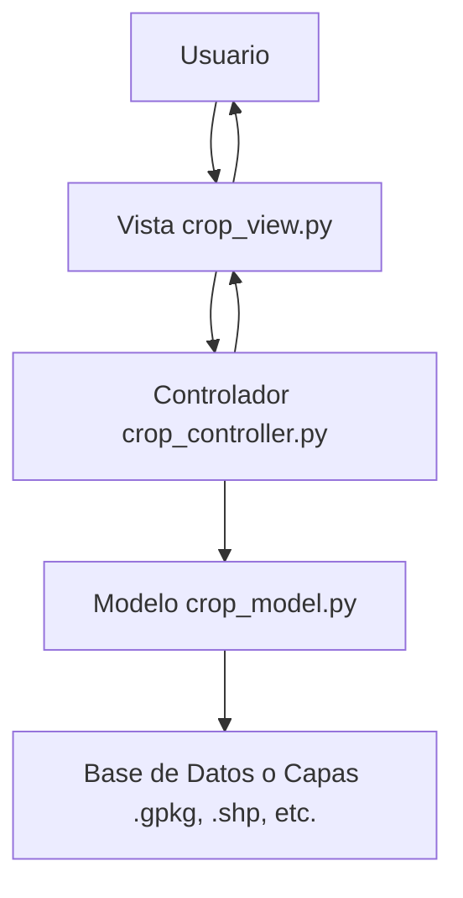
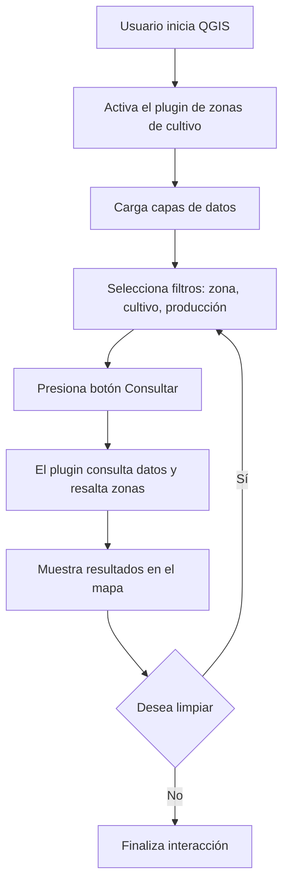
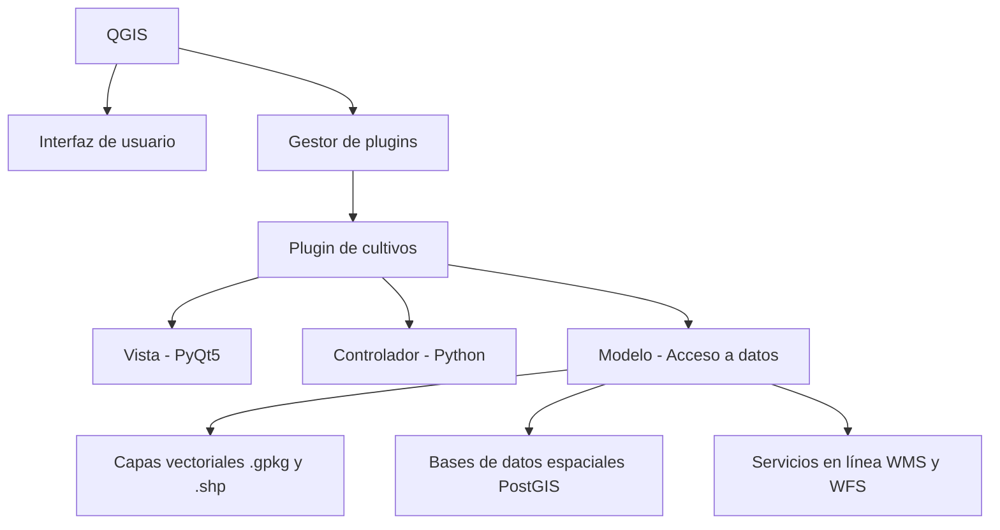

# Manual Técnico - Plugin de visualización Inteligente de Zonas de Cultivo y Producción en la Zona Occidental de El Salvador con QGIS

## Índice
1. [Documentación de QGIS: Instalación y uso básico](#1-documentación-de-qgis-instalación-y-uso-básico)
2. [Descripción General](#2-descripción-general)
3. [Arquitectura del Sistema](#3-arquitectura-del-sistema)
4. [Archivos Clave](#4-archivos-clave)
5. [Requisitos](#5-requisitos)
6. [Instalación del Plugin](#6-instalación-del-plugin)
7. [Uso del Plugin](#7-uso-del-plugin)
8. [Pruebas y Cobertura](#8-pruebas-y-cobertura)
9. [CI/CD y Automatización](#9-cicd-y-automatización)
10. [Dependencias](#10-dependencias)

## 1. Documentación de QGIS: Instalación y uso básico

### ¿Qué es QGIS?
QGIS (Quantum Geographic Information System) es un sistema de información geográfica (SIG) gratuito y de código abierto que permite la visualización, edición, análisis y publicación de información geoespacial. Es compatible con múltiples formatos de datos (raster y vectoriales) y se puede extender mediante complementos (plugins), lo que lo hace una alternativa potente y flexible frente a soluciones propietarias.

Está disponible para sistemas operativos Windows, Linux y macOS, y es ampliamente usado en los sectores académico, gubernamental y privado.

### ¿Dónde obtener QGIS?
QGIS puede descargarse desde su sitio oficial:

🔗 https://qgis.org/es/site/forusers/download.html

Allí encontrarás versiones para los principales sistemas operativos. Se recomienda descargar la versión LTR (Long Term Release), ya que garantiza mayor estabilidad para entornos de producción

### Requisitos mínimos recomendados
- **Sistema operativo**: Windows 10+, macOS 11+, o una distribución Linux actualizada.
- **Procesador**: Intel Core i5 o superior.
- **Memoria RAM**: mínimo 4 GB (recomendado 8 GB o más para manejo de capas grandes).
- **Almacenamiento**: 2 GB de espacio libre para la instalación.
- **Resolución de pantalla**: 1280x768 o superior.

### Instalación

#### En Windows
1. Ve a la página de descarga y selecciona el instalador correspondiente (standalone installer).
2. Ejecuta el instalador y sigue las instrucciones. Elige instalar la versión LTR si es tu primera vez.
3. Se instalarán QGIS, GRASS GIS y otros componentes útiles por defecto.

#### En Linux (Ubuntu/Debian)
```bash
sudo apt update
sudo apt install qgis qgis-plugin-grass
```

También puedes añadir el repositorio oficial de QGIS para versiones más recientes.

#### En macOS
1. Descarga el archivo .dmg desde la web oficial.
2. Instala primero los paquetes de dependencias (como GDAL y Python si se requiere).
3. Arrastra QGIS a tu carpeta de Aplicaciones.

### Primeros pasos con QGIS
Al iniciar QGIS verás una interfaz dividida en varias áreas clave:

- **Barra de herramientas**: permite acceder a funciones comunes (agregar capas, hacer zoom, medir distancias, etc.).
- **Panel de capas**: muestra la lista de capas cargadas y su orden de visualización.
- **Lienzo del mapa**: área principal donde se renderizan las capas.
- **Panel de navegador**: facilita el acceso rápido a archivos y bases de datos geográficas.
- **Consola de Python**: permite ejecutar comandos directamente usando PyQGIS.

### Tipos de datos que puedes usar
QGIS trabaja con dos tipos principales de datos:

**Vectoriales**: puntos, líneas o polígonos. Formatos comunes:
- .shp (Shapefile)
- .geojson
- .gpkg (GeoPackage)
- .kml, .csv con coordenadas

**Raster**: imágenes compuestas por píxeles. Ejemplos:
- Imágenes satelitales
- Modelos digitales de elevación
- .tif, .jpg, .png georreferenciados

También se puede conectar a bases de datos espaciales como PostGIS, Spatialite, y servicios en línea como WMS, WMTS y WFS.

### Uso de complementos (plugins)
QGIS tiene una gran comunidad que ha desarrollado numerosos plugins. Para acceder a ellos:

1. Ir a **Complementos > Administrar e instalar complementos**.
2. Buscar por nombre (ej. "QuickMapServices", "OpenLayers Plugin", "qgis2web").
3. Instalar y activar el plugin.

**Nota**: El plugin descrito en este manual es uno de estos complementos personalizados que puedes cargar manualmente.

### Recursos de ayuda y formación
- **Manuales oficiales**: https://docs.qgis.org
- **Foros y comunidad**:
  - StackExchange: https://gis.stackexchange.com
  - Reddit: https://reddit.com/r/QGIS

## 2. Descripción General

Este plugin para QGIS está diseñado para integrarse dentro de la interfaz del programa. Permite visualizar y analizar zonas de cultivo en el occidente de El Salvador. Facilita la consulta y el filtrado de zonas según tipo de cultivo y nivel de producción, resaltando automáticamente las áreas que cumplen los criterios seleccionados.

## 3. Arquitectura del Sistema

El plugin sigue el patrón Modelo-Vista-Controlador (MVC), integrándose directamente con la estructura de QGIS y PyQt5.

### 3.1 Modelo (models/)
- **crop_model.py**: Gestiona la lógica de acceso y consulta de datos de cultivos. Proporciona métodos para obtener los cultivos disponibles y otros datos requeridos por la vista y el controlador.

### 3.2 Vista (views/)
- **crop_view.py**: Define la interfaz gráfica del usuario (GUI) usando PyQt5 y se muestra como un panel dentro de QGIS. Incluye:
  - ComboBox para zona y tipo de cultivo
  - Radio buttons para seleccionar un solo departamento
  - ComboBox para nivel de producción (Alto, Medio, Bajo)
  - Botones de consulta y limpieza
  - Etiquetas para mostrar resultados y mensajes de estado

### 3.3 Controlador (controllers/)
- **crop_controller.py**: Orquesta la interacción entre la vista y el modelo. Gestiona los eventos de la interfaz, ejecuta las consultas sobre los datos y actualiza la vista con los resultados.

### 3.4 Flujo de Datos
1. El usuario selecciona zona, departamento, tipo de cultivo y nivel de producción en la interfaz del plugin
2. Al presionar "Consultar", el controlador toma los parámetros y realiza la consulta al modelo
3. Las zonas de cultivo que cumplen los criterios se resaltan en el mapa
4. Se muestran los resultados en la interfaz
5. El botón "Limpiar" restablece la búsqueda y visualización

### 3.5 Diagrama de flujo del uso del plugin


### 3.6 Diagrama de Arquitectura del Sistema (MVC)


### 3.7 Diagrama de interacción del usuario con el plugin


### 3.8 Mapa conceptual del entorno técnico (QGIS + Plugin)


## 4. Archivos Clave

- **plugin.py**: Inicializa y registra el plugin dentro de QGIS
- **controllers/crop_controller.py**: Lógica principal de interacción
- **models/crop_model.py**: Acceso y consulta de datos
- **views/crop_view.py**: Interfaz del usuario
- **config.py**: Configuración del plugin y variables de entorno
- **requirements.txt**: Lista de dependencias de producción
- **requirements-dev.txt**: Dependencias de desarrollo y testing
- **tests/**: Directorio con todas las pruebas unitarias, funcionales e integración
- **README.md**: Documentación técnica completa
- **Occidente.gpkg, Cultivos.gpkg**: Capas de ejemplo para la ejecución

## 5. Requisitos

- **QGIS 3.22 o superior**
- **Python 3.9+**
- **PyQt5**

## 6. Instalación del Plugin

1. Descargue o clone el repositorio del plugin
2. Copie la carpeta al directorio de plugins de QGIS:

   **Windows:**
   ```
   C:\Users\<usuario>\AppData\Roaming\QGIS\QGIS3\profiles\default\python\plugins\
   ```

   **Linux:**
   ```
   ~/.local/share/QGIS/QGIS3/profiles/default/python/plugins/
   ```

   **macOS:**
   ```
   ~/Library/Application Support/QGIS/QGIS3/profiles/default/python/plugins/
   ```

3. Inicie QGIS
4. Active el plugin desde "Plugins > Gestionar e instalar plugins"
5. También puede instalarlo como archivo .zip desde el menú antes mencionado

## 7. Uso del Plugin

1. Cargue la capa vectorial de zonas de cultivo (por ejemplo `Cultivos.gpkg`)
2. Seleccione los filtros: zona, departamento, tipo de cultivo y nivel de producción
3. Presione "Consultar" para visualizar los resultados
4. Las zonas coincidentes se resaltarán en el mapa
5. Utilice el botón "Limpiar" para reiniciar la consulta

## 8. Pruebas y Cobertura

### 📊 Estado Actual de las Pruebas
- **Cobertura General**: 81% ✅
- **Archivos Probados**: 10/11
- **Líneas Cubiertas**: 300/359
- **Cobertura de Ramas**: 72%

### 🏗️ Estructura de Pruebas
```
tests/
├── unit/                    # Pruebas unitarias
│   ├── test_config.py      # Configuración y variables de entorno
│   ├── test_crop_model.py  # Modelo de datos de cultivos
│   └── test_plugin.py      # Plugin principal
├── functional/             # Pruebas funcionales
│   └── test_ui.py         # Interfaz de usuario
├── integration/           # Pruebas de integración
│   └── test_pipeline.py   # Pipeline completo
└── fixtures/              # Datos de prueba
    ├── test_cultivos.gpkg
    └── test_occidente.gpkg
```

### 🧪 Comandos de Prueba

#### Pruebas Rápidas (Core)
```bash
python run_tests.py --type core --fast
```

#### Todas las Pruebas Unitarias
```bash
python run_tests.py --type unit
```

#### Todas las Pruebas con Cobertura
```bash
python run_tests.py --type all
```

#### Pruebas Específicas
```bash
# Probar solo configuración
python -m pytest tests/unit/test_config.py -v

# Probar solo modelo de cultivos
python -m pytest tests/unit/test_crop_model.py -v

# Probar solo plugin principal
python -m pytest tests/unit/test_plugin.py -v
```

### 📈 Comandos de Cobertura

#### Generar Reporte HTML
```bash
python -m pytest --cov --cov-report=html
```

#### Reporte en Terminal
```bash
python -m pytest --cov --cov-report=term-missing
```

#### Reporte XML (para CI/CD)
```bash
python -m pytest --cov --cov-report=xml
```

#### Ver Reporte de Cobertura
```bash
# Windows
start htmlcov/index.html

# macOS
open htmlcov/index.html

# Linux
xdg-open htmlcov/index.html
```

### 🔍 Análisis de Cobertura por Archivo

| Archivo | Cobertura | Estado | Observaciones |
|---------|-----------|--------|---------------|
| `config.py` | 98% | ✅ Excelente | Configuración bien probada |
| `models/crop_model.py` | 98% | ✅ Excelente | Modelo de datos robusto |
| `plugin.py` | 100% | ✅ Perfecto | Plugin principal completo |
| `controllers/crop_controller.py` | 78% | ⚠️ Bueno | Necesita más pruebas de UI |
| `views/crop_view.py` | 85% | ✅ Bueno | Vista bien cubierta |
| `__init__.py` | 33% | ❌ Mejorar | Archivo de inicialización |
| `resources_rc.py` | 0% | ❌ No probado | Recursos compilados |
| `compile_resources.py` | 0% | ❌ No probado | Script de compilación |

### 🎯 Pruebas Avanzadas

#### Pruebas con Timeout
```bash
python -m pytest --timeout=300
```

#### Pruebas con Salida Detallada
```bash
python -m pytest -v --tb=short
```

#### Pruebas por Categoría
```bash
# Solo pruebas unitarias
python -m pytest -m unit

# Solo pruebas funcionales
python -m pytest -m functional

# Solo pruebas de integración
python -m pytest -m integration
```

#### Verificar Umbrales de Cobertura
```bash
# Mínimo 60% cobertura general
python -m pytest --cov --cov-fail-under=60

# Mínimo 40% cobertura unitaria
python -m pytest --cov --cov-fail-under=40 tests/unit/
```

### 🔧 Solución de Problemas

#### Limpiar Cache y Reiniciar
```bash
# Limpiar cache de pytest
python -m pytest --cache-clear

# Limpiar datos de cobertura
coverage erase
```

#### Depurar Fallos de Pruebas
```bash
# Ejecutar con depuración
python -m pytest -s -vv --tb=long

# Ejecutar prueba específica con depuración
python -m pytest tests/unit/test_config.py::TestConfig::test_config_default_values -s -vv
```

### 📁 Ubicación de Archivos de Prueba

- **Reporte HTML de Cobertura**: `htmlcov/index.html`
- **Reporte XML de Cobertura**: `coverage.xml`
- **Configuración de Cobertura**: `.coveragerc`
- **Configuración de Pytest**: `pytest.ini`
- **Archivos de Prueba**: `tests/unit/`, `tests/functional/`, `tests/integration/`

## 9. CI/CD y Automatización

### 🚀 Pipeline de Integración Continua

El proyecto incluye un pipeline de CI/CD automatizado que se ejecuta en GitHub Actions:

#### Características del Pipeline:
- **Activación**: Push a `main` o `develop`, Pull Requests, o manualmente
- **Entorno**: Ubuntu con Python 3.11
- **Cobertura Mínima**: 60%
- **Reportes**: HTML, XML y artefactos descargables

#### Etapas del Pipeline:
1. **Configuración del Entorno**
   - Instalación de Python y dependencias
   - Configuración de QGIS mocks para CI

2. **Verificación de Calidad**
   - Linting con flake8
   - Verificación de formato de código
   - Análisis de seguridad

3. **Pruebas Principales**
   - Pruebas unitarias (config, modelo, plugin)
   - Generación de reportes de cobertura
   - Verificación de umbrales mínimos

4. **Pruebas de Integración**
   - Pruebas del pipeline completo
   - Validación de entorno CI/CD
   - Verificación de configuraciones

5. **Reportes y Artefactos**
   - Generación de reportes HTML/XML
   - Subida de artefactos
   - Notificaciones de estado

#### Simulación Local del Entorno CI
```bash
# Configurar variables de entorno CI
set ENVIRONMENT=test
set CI=true
python -m pytest --cov
```

#### Monitoreo del Pipeline
- **GitHub Actions**: Pestaña "Actions" en el repositorio
- **Estado de Builds**: Badges en el README
- **Reportes de Cobertura**: Artefactos descargables

### 🔄 Automatización de Desarrollo

#### Pre-commit Hooks
```bash
# Instalar pre-commit hooks
pip install pre-commit
pre-commit install

# Ejecutar manualmente
pre-commit run --all-files
```

#### Scripts de Automatización
- **`run_tests.py`**: Runner de pruebas optimizado
- **`verify_tests.py`**: Verificación de integridad
- **`setup_ci_cd.py`**: Configuración automática de CI/CD

## 10. Dependencias

### Dependencias de Producción (`requirements.txt`)
```txt
PyQt5>=5.15.0
qgis>=3.22.0
```

### Dependencias de Desarrollo (`requirements-dev.txt`)
```txt
# Testing frameworks
pytest>=7.0.0
pytest-cov>=4.0.0
pytest-mock>=3.10.0
pytest-qt>=4.2.0
pytest-timeout>=2.1.0

# Coverage tools
coverage>=7.0.0

# Mocking and testing utilities
mock>=5.0.0

# Environment management
python-dotenv>=1.0.0

# Code quality tools
flake8>=6.0.0
black>=23.0.0
isort>=5.12.0

# Documentation
sphinx>=5.0.0
sphinx-rtd-theme>=1.2.0

# Development utilities
pre-commit>=3.0.0
tox>=4.0.0

# GUI testing
pytest-qt>=4.2.0
```

### Instalación de Dependencias

#### Producción
```bash
pip install -r requirements.txt
```

#### Desarrollo
```bash
pip install -r requirements-dev.txt
```

#### Configuración Completa de Desarrollo
```bash
# Instalar dependencias de desarrollo
pip install -r requirements-dev.txt

# Configurar pre-commit hooks
pre-commit install

# Ejecutar configuración de CI/CD
python setup_ci_cd.py

# Verificar instalación
python verify_tests.py
```

---

## 📞 Soporte y Contribución

### Reportar Problemas
- **Issues**: Usar GitHub Issues para reportar bugs
- **Documentación**: Mejorar la documentación via Pull Requests
- **Pruebas**: Añadir nuevas pruebas para casos no cubiertos

### Desarrollo
1. Fork del repositorio
2. Crear rama de feature: `git checkout -b feature/nueva-funcionalidad`
3. Ejecutar pruebas: `python run_tests.py --type all`
4. Commit cambios: `git commit -m "feat: nueva funcionalidad"`
5. Push: `git push origin feature/nueva-funcionalidad`
6. Crear Pull Request

### Estándares de Código
- **Cobertura mínima**: 60%
- **Estilo**: PEP 8
- **Documentación**: Docstrings para todas las funciones públicas
- **Pruebas**: Pruebas unitarias para nueva funcionalidad

---

**Versión**: 2.0.0  
**Última actualización**: Enero 2025  
**Licencia**: [Especificar licencia] 
=======